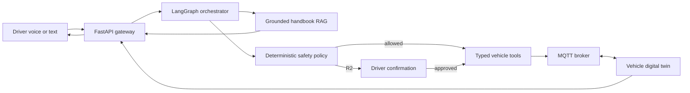

# VIVI Cabin Copilot

> **DEV-01 · AI20K Cohort 4 · Team P-126**
> Trợ lý cabin tiếng Việt chạy offline-first trên edge, hỗ trợ điều khiển xe mô phỏng và tra cứu sổ tay có trích dẫn, với safety policy và human-in-the-loop (HITL) cho thao tác nhạy cảm.

## Trạng thái

Dự án đang ở **Gate G1 — chốt đề tài và thiết kế**. Kiến trúc và kế hoạch trong repository là thiết kế mục tiêu; code trong `src/` hiện vẫn là starter scaffold và chưa đại diện cho toàn bộ chức năng được mô tả.

## Bài toán

Trợ lý trong xe phụ thuộc cloud có thể phản hồi chậm hoặc mất một phần năng lực khi xe đi qua khu vực mạng yếu. Đồng thời, dùng mô hình ngôn ngữ để điều khiển chức năng vật lý tạo ra rủi ro gọi sai tool, dùng sai tham số hoặc trả lời sổ tay không có căn cứ.

VIVI Cabin Copilot tập trung vào bốn giá trị:

- Hoạt động offline cho các luồng cốt lõi bằng SLM lượng tử hóa chạy local.
- Điều khiển **vehicle digital twin** qua typed tools và MQTT; không kết nối CAN hoặc xe thật.
- Tra cứu sổ tay bằng RAG, bắt buộc có citation hoặc từ chối trả lời.
- Đặt deterministic safety policy và HITL giữa agent và mọi thao tác nhạy cảm.

## Phạm vi MVP

- Hai vai trò: tài xế và kỹ sư hệ thống.
- Nhập lệnh tiếng Việt bằng text và voice, luôn có text fallback.
- Tối thiểu năm intent điều khiển cabin mô phỏng.
- RAG sổ tay theo dòng/phiên bản xe, có trang hoặc section nguồn.
- R0-R3 safety policy; cửa và kính thuộc R2, cần xác nhận một lần có thời hạn.
- SLM Q4 chạy local; core flow được kiểm thử khi chặn WAN.
- Trace và metric cho intent, grounding, tool success và end-to-end latency.

Không thuộc MVP: điều khiển xe thật, phanh/lái/truyền động, chứng nhận automotive safety, bản đồ toàn quốc, voice biometrics và OTA thật.

## Gate G1 deliverables

| Deliverable | Tài liệu |
|---|---|
| 1-page Brief | [`docs/BRIEF.md`](docs/BRIEF.md) |
| Product Requirements Document | [`docs/PRD.md`](docs/PRD.md) |
| Wireframe và UI Flow | [`docs/UI_FLOW.md`](docs/UI_FLOW.md) |
| GitHub Repo & AI Log Setup | [`docs/AI_LOG_SETUP.md`](docs/AI_LOG_SETUP.md) |

Tài liệu hỗ trợ:

- [Kiến trúc mục tiêu](docs/architecture_diagram.md)
- [Kế hoạch triển khai 5 tuần](docs/project_plan_5_weeks.md)

## Kiến trúc tóm tắt



LLM chỉ đề xuất intent, kế hoạch và tool call. Policy code kiểm tra quyền, trạng thái xe, giới hạn tham số và xác nhận; acknowledgement từ simulator mới là nguồn sự thật về kết quả hành động.

## Tech stack dự kiến

| Lớp | Công nghệ |
|---|---|
| Agent | LangGraph, typed tool schemas |
| Local inference | llama.cpp hoặc Ollama; Qwen2.5-3B/Phi-3-mini GGUF Q4 |
| Speech | PhoWhisper hoặc whisper.cpp; VietTTS/Piper |
| Backend | FastAPI, Pydantic, WebSocket |
| RAG | Chroma hoặc FAISS, multilingual embeddings |
| Simulator | MQTT/Mosquitto, Python vehicle digital twin |
| Frontend | Next.js/React |
| Persistence | SQLite và local metrics |
| Delivery | Docker Compose, GitHub Actions |

## Quick start hiện tại

Yêu cầu Python 3.11. Starter backend cần API key để chạy agent mẫu; implementation offline sẽ thay thế phụ thuộc này theo kế hoạch dự án.

```bash
git clone https://github.com/AI20K-Build-Phase-Cohort-4/P-126.git
cd P-126

python3.11 -m venv .venv
source .venv/bin/activate
pip install -r requirements.txt

cp .env.example .env
uvicorn src.main:app --reload --port 8000
```

Kiểm tra tại <http://localhost:8000/health> và Swagger tại <http://localhost:8000/docs>.

```bash
make lint
make test
```

## AI usage logging

Repository đã có hook cho Claude Code, Cursor, Codex CLI, Gemini CLI, GitHub Copilot và Antigravity. Mỗi thành viên chạy một lần:

```bash
cp .env.example .env
# Điền AI_LOG_API_KEY cá nhân trong .env
bash scripts/setup_hooks.sh
```

Với ChatGPT hoặc công cụ web không có hook:

```bash
bash scripts/_pyrun.sh scripts/log_manual.py \
  --tool chatgpt \
  --prompt "Tóm tắt mục đích sử dụng AI" \
  --result "Quyết định hoặc đầu ra đã được thành viên kiểm tra"
```

Chi tiết và checklist xác minh: [`docs/AI_LOG_SETUP.md`](docs/AI_LOG_SETUP.md).

## Cấu trúc repository

```text
src/                    Starter backend và LangGraph scaffold
tests/                  Unit/API tests
docs/                   Brief, PRD, UI flow, kiến trúc và kế hoạch
eval/                   Evaluation evidence và report
presentation/           Pitch deck và video
scripts/                AI logging và setup scripts
.github/workflows/      CI
JOURNAL.md              Tổng kết theo tuần
WORKLOG.md              Theo dõi công việc hằng ngày
```

## Nhóm và ownership dự kiến

| Thành viên | Ownership chính |
|---|---|
| Hùng | Platform, FastAPI, MQTT simulator, Docker và observability |
| Phong | Edge SLM, STT/TTS và inference benchmark |
| Dương | LangGraph, RAG, safety/HITL và evaluation |
| Khải | UI/UX, edge optimization, multimodal spike và quality evidence |

Mỗi hạng mục cần một người chịu trách nhiệm trực tiếp và ít nhất một người review. Ownership có thể được điều chỉnh trong `WORKLOG.md` khi triển khai.

## License

[MIT](LICENSE). Vehicle actions trong dự án chỉ là mô phỏng phục vụ giáo dục.
