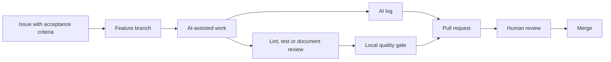

# GitHub Repository và AI Log Setup

> Deliverable G1 này mô tả trạng thái repository, cách mỗi thành viên bật AI logging và cách kiểm chứng log trước khi push. Không commit API key hoặc nội dung `.ai-log/session.jsonl`.

## 1. Repository chính thức

- Repository: <https://github.com/AI20K-Build-Phase-Cohort-4/P-126>
- Local quality gate: `scripts/check_local.sh`
- Pull request template: `.github/PULL_REQUEST_TEMPLATE.md`
- AI hook installers: `scripts/setup_hooks.sh`, `scripts/setup_hooks.ps1`
- Log local mặc định: `.ai-log/session.jsonl` (đã được `.gitignore` bỏ qua)

Repository đã có hook configuration cho:

| Công cụ | Cấu hình |
|---|---|
| Claude Code | `.claude/settings.json` |
| Cursor | `.cursor/hooks.json` |
| OpenAI Codex CLI | `.codex/hooks.json` |
| Gemini CLI | `.gemini/settings.json` |
| GitHub Copilot | `.github/hooks/hooks.json` |
| Antigravity | `.agents/hooks.json` |

ChatGPT web và các công cụ không hỗ trợ hook được ghi bằng `scripts/log_manual.py`.

## 2. Setup bắt buộc cho từng thành viên

```bash
git clone https://github.com/AI20K-Build-Phase-Cohort-4/P-126.git
cd P-126

cp .env.example .env
# Thay AI_LOG_API_KEY trong .env bằng key cá nhân từ Phoenix.

bash scripts/setup_hooks.sh
```

Trên Windows PowerShell:

```powershell
Copy-Item .env.example .env
powershell -ExecutionPolicy Bypass -File scripts\setup_hooks.ps1
```

Mỗi người phải dùng email Git được BTC nhận diện:

```bash
git config user.name
git config user.email
```

Không đưa `.env`, API key, access token hoặc raw audio vào commit, issue, PR hay AI prompt.

## 3. Ghi log thủ công

Khi dùng ChatGPT web hoặc một công cụ không có hook:

```bash
bash scripts/_pyrun.sh scripts/log_manual.py \
  --tool chatgpt \
  --model "model-used" \
  --prompt "Tóm tắt mục đích của yêu cầu, không chép dữ liệu nhạy cảm" \
  --result "Đầu ra nào được dùng và thành viên đã kiểm chứng ra sao"
```

Có thể chạy interactive mode:

```bash
bash scripts/_pyrun.sh scripts/log_manual.py
```

Một log tốt cần trả lời:

1. Thành viên dùng công cụ/model nào?
2. AI được yêu cầu hỗ trợ việc gì?
3. Đầu ra nào được giữ, sửa hoặc loại bỏ?
4. Con người đã kiểm chứng bằng review, test hoặc nguồn nào?
5. File hoặc quyết định nào bị ảnh hưởng?

Không cần đưa nguyên văn prompt dài, secret, dữ liệu cá nhân hoặc nội dung sổ tay có hạn chế bản quyền vào trường log.

## 4. Kiểm chứng local

Sau khi tạo một manual log thử nghiệm:

```bash
test -f .ai-log/session.jsonl
tail -n 1 .ai-log/session.jsonl
git status --short
```

Kết quả mong đợi:

- `session.jsonl` tồn tại và có một JSON object hợp lệ.
- `git status` không liệt kê nội dung `.ai-log/*.jsonl`.
- Entry có `student`, `repo`, `branch`, `commit`, `tool`, `prompt` và timestamp.

Pre-push hook được quản lý tại `.githooks/pre-push` và bật bằng
`core.hooksPath`. Có thể kiểm tra:

```bash
test "$(git config core.hooksPath)" = ".githooks"
bash scripts/check_local.sh
```

Hook chặn push khi local quality gate thất bại. Sau khi gate xanh, hook gọi
`scripts/submit_log.py`; grading server tạm thời không khả dụng không chặn push. Thành
viên vẫn phải kiểm tra dashboard Phoenix để chắc chắn log đã được nhận.

## 5. Quy trình GitHub tối thiểu



Quy ước:

- Một task có acceptance criteria rõ trước khi code.
- Branch gợi ý: `docs/g1-deliverables`, `feat/mqtt-twin`, `test/safety-policy`.
- Commit dùng Conventional Commits: `docs:`, `feat:`, `fix:`, `test:`, `chore:`.
- Không tự merge thay đổi quan trọng về safety, prompt, eval set hoặc architecture mà thiếu reviewer.
- PR phải khai báo có dùng AI hay không, link log/evidence và cách kiểm chứng output.

## 6. Definition of Done cho setup G1

- [x] Repository chính thức và remote `origin` đã tồn tại.
- [x] Local lint/test gate đã có trong `scripts/check_local.sh`.
- [x] Hook configs cho sáu công cụ AI đã có.
- [x] Manual logger và pre-push submitter đã có.
- [x] `.gitignore` không track raw AI session logs và secrets.
- [x] Pull request template yêu cầu khai báo AI usage.
- [ ] Mỗi thành viên tự điền `AI_LOG_API_KEY`, cài hook và tạo một test entry.
- [ ] Mỗi thành viên xác minh log xuất hiện trên Phoenix sau lần push đầu tiên.

Hai dòng cuối cần từng thành viên tự hoàn thành trên máy và tài khoản của mình; repository không thể làm thay.
