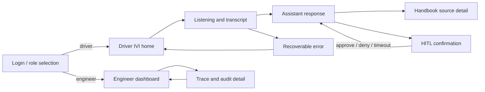
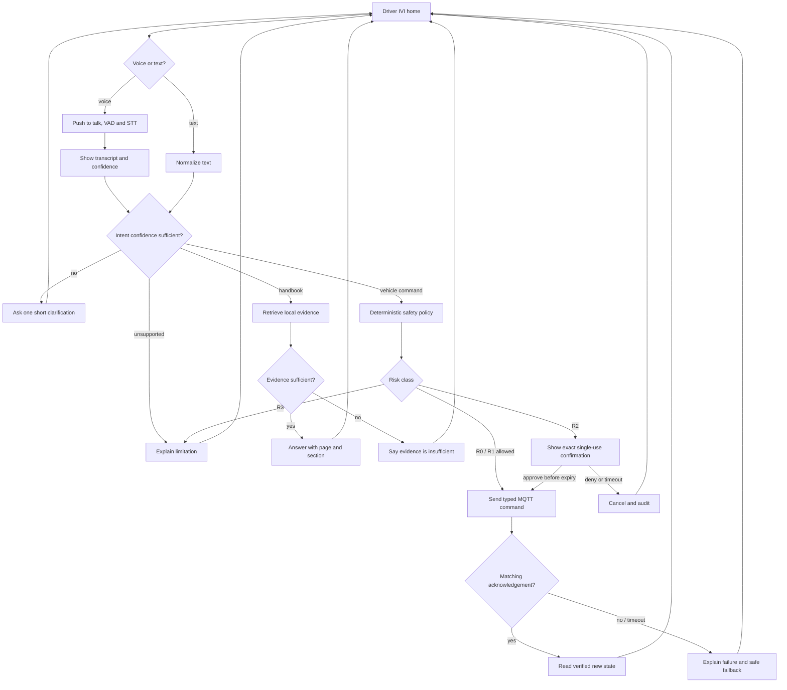

# VIVI Cabin Copilot — Wireframe và UI Flow

> Wireframe G1 mô tả thông tin và hành vi, chưa chốt visual identity. Thiết kế ưu tiên voice, chữ lớn, ít thao tác và luôn có text fallback.

## 1. Screen map



## 2. Driver command flow



## 3. Driver IVI wireframe

```text
┌──────────────────────────────────────────────────────────────────┐
│ VIVI Cabin Copilot                 OFFLINE ●        21:35       │
├───────────────────────┬──────────────────────────────────────────┤
│ TRẠNG THÁI XE         │ TRỢ LÝ                                  │
│                       │                                          │
│ Điều hòa       24°C   │  “Tôi có thể giúp gì?”                  │
│ Quạt           Mức 2  │                                          │
│ Cửa            Đã khóa│  Transcript xuất hiện tại đây            │
│ Kính           Đã đóng│                                          │
│ Pin             72%   │          [  Nhấn để nói  ]               │
│ Tốc độ        0 km/h  │                                          │
│                       │  [ Nhập câu lệnh...             ] [Gửi]  │
├───────────────────────┴──────────────────────────────────────────┤
│ Gợi ý: “Đặt điều hòa 24 độ” · “Đèn ABS có nghĩa là gì?”         │
└──────────────────────────────────────────────────────────────────┘
```

Trạng thái bắt buộc phải nhìn thấy:

- Online/offline và model local đang dùng.
- Listening, transcribing, thinking, waiting confirmation, executing và failed.
- Transcript để người dùng phát hiện STT nghe sai.
- Kết quả tool dựa trên trạng thái simulator, không chỉ lời model.

## 4. Handbook answer wireframe

```text
┌──────────────────────────────────────────────────────────────┐
│ Đèn cảnh báo áp suất lốp cho biết hệ thống phát hiện áp suất │
│ ở ít nhất một lốp thấp hơn ngưỡng khuyến nghị. Hãy giảm tốc  │
│ và kiểm tra lốp ở vị trí an toàn.                            │
│                                                              │
│ Nguồn: Sổ tay VF 8 · phiên bản 2026 · trang 184              │
│ [Mở đoạn nguồn]                         [Đọc lại câu trả lời] │
└──────────────────────────────────────────────────────────────┘
```

Nếu không đủ bằng chứng, UI phải nói rõ “Không tìm thấy thông tin phù hợp trong sổ tay đang chọn” và không tạo câu trả lời suy đoán.

## 5. HITL confirmation trong hội thoại

```text
┌──────────────────────────────────────────────────────────────┐
│ ViVi: Xác nhận mở cửa sổ bên tài ở mức 20 phần trăm?         │
│                                                              │
│ Người dùng nói: “Xác nhận” / “Đồng ý” / “Hủy”                │
│ hoặc nhập câu trả lời vào ô chat.                            │
└──────────────────────────────────────────────────────────────┘
```

Không mở popup hoặc yêu cầu bấm nút xác nhận. Confirmation vẫn gắn với đúng
action/target/value và có hạn dùng; timeout, deny hoặc replay không được gửi MQTT
command. Một lần chạm vào control cụ thể trong bảng thân xe được xem là approval
cho đúng action đang hiển thị; UI tự gửi confirmation ID tương ứng. Yêu cầu bắt
đầu từ mic hoặc ô chat vẫn phải được xác nhận bằng một lượt thoại/chat riêng.

## 6. Engineer dashboard wireframe

```text
┌──────────────────────────────────────────────────────────────────┐
│ ENGINEER DASHBOARD               Qwen2.5-3B Q4 · Local healthy │
├──────────────┬──────────────┬──────────────┬────────────────────┤
│ Voice p95    │ Intent F1    │ Tool success │ Grounded answers   │
│ 2.4 s        │ 0.92         │ 97%          │ 95%                │
├──────────────┴──────────────┴──────────────┴────────────────────┤
│ Selected trace: req-0184                                        │
│ VAD 80ms → STT 430ms → Router 110ms → Policy 4ms → Tool 22ms   │
├────────────────────────────────┬─────────────────────────────────┤
│ REQUESTS                       │ SYSTEM                          │
│ ✓ set_temperature             │ STT          healthy            │
│ ✓ handbook_query              │ SLM          2.3 GB loaded      │
│ ✗ open_window: HITL timeout   │ MQTT         connected          │
│                                │ RAG index     vf8-2026-v1        │
└────────────────────────────────┴─────────────────────────────────┘
```

Các số trong wireframe chỉ là dữ liệu minh họa bố cục, không phải kết quả đo. G1 chỉ yêu cầu wireframe; dashboard đầy đủ là P1.

## 7. Error and degraded states

| Tình huống | UI response | Không được làm |
|---|---|---|
| STT confidence thấp | Hiện transcript, hỏi lại hoặc cho sửa text | Tự đoán action nhạy cảm |
| SLM unavailable | Chuyển sang deterministic core intents nếu có | Im lặng hoặc báo thành công giả |
| MQTT timeout | Báo chưa xác minh được trạng thái | Nói action đã hoàn thành |
| RAG thiếu bằng chứng | Abstain và cho mở sổ tay | Trả lời theo kiến thức chung |
| WAN mất | Hiện offline; giữ core local flows | Chặn điều hòa/RAG local |
| HITL timeout | Hủy action và ghi audit | Tự động approve |

## 8. Accessibility và in-car constraints

- Voice-first khi simulated speed > 0; chặn multi-touch không thiết yếu.
- Target chính tối thiểu khoảng 44×44 px, label rõ và có trạng thái focus.
- Không chỉ dùng màu để biểu diễn lỗi hoặc xác nhận.
- Câu trả lời nói ngắn; chi tiết và citation nằm trên màn hình.
- Luôn có cancel và text fallback.

## 9. Traceability

| Screen/flow | PRD requirement |
|---|---|
| Login và role routing | FR-1 |
| Push-to-talk, transcript, text fallback | FR-2 |
| Clarification và intent routes | FR-3 |
| Vehicle state và acknowledgement | FR-4 |
| HITL qua lượt thoại/chat | FR-5 |
| Citation source detail | FR-6 |
| Error/degraded states | FR-7 |
| Engineer trace dashboard | FR-8 |
