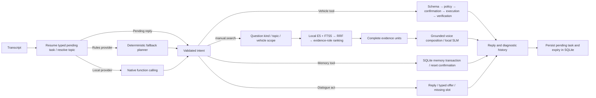

# Thiết kế agents và RAG sau đợt rà soát hội thoại 07/10/2026

## Vấn đề thực tế

Backend mặc định đang chạy `rules`. Đã tải và thử Qwen3 1.7B Q4_K_M local; xem
`docs/dialogue_tasks.md` để biết kết quả và giới hạn trước khi bật. Embedding E5 là model truy xuất,
không phải model sinh hội thoại. System prompt chỉ tác động khi đường chạy gọi SLM.
Bản sửa dựa trên các câu mẫu trước đó đã bỏ sót những cách nói gần nghĩa và hội thoại
nhiều lượt. Các lỗi trong log mới gồm:

| Yêu cầu | Lỗi quan sát | Xử lý hiện tại |
| --- | --- | --- |
| “không có gì, bạn chạy tiếp đi” | Hỏi lại người dùng muốn làm gì | Xác nhận ngắn; không điều khiển xe |
| “bạn biết gì về con xe này” | Đọc thông số mòn gai lốp | Hỏi người dùng chọn pin/sạc, cabin hoặc hỗ trợ lái |
| “màn hình đang báo cái gì kia” | Câu hỏi chung, không bám yêu cầu | Xin thông báo hoặc biểu tượng; không giả định có khả năng nhìn màn hình |
| “tính năng hỗ trợ giữ làn là gì” | Không nhận ra chủ đề | Dùng cùng danh mục tính năng với retriever, chọn định nghĩa LKA |
| “vf8 có cruise control không” | Đọc câu “người lái chỉ kiểm soát vô lăng” | Giải thích ACC, giữ điều kiện trang bị từ nguồn |
| “tôi cần bạn giới thiệu về tính năng đấy ấy” sau ADAS | Mất chủ đề | Giải quyết tham chiếu trước khi chọn tool/truy xuất |
| “ADAS là gì” | Chỉ nhắc một cảnh báo hoặc hướng dẫn nút | Tổng hợp ví dụ tính năng từ nguồn và giới hạn hỗ trợ người lái |

Hai lỗi thiết kế quan trọng: classifier vừa hiểu câu hỏi vừa tự nhận diện tham số,
trò chuyện và quản lý ngữ cảnh trong một hàm lớn; retriever và bộ chọn câu lại có
những tập từ khóa khác nhau. Citation hợp lệ chỉ chứng minh ID tồn tại, chưa chứng
minh câu trả lời đúng ý câu hỏi.

## Luồng xử lý



`classifier.py` là facade sync/async và cấu hình provider. `planner.py` chọn loại
việc cần làm; `commands.py` chỉ phân tích lệnh tiện ích; `slots.py` chứa parser
vị trí/nhiệt độ dùng chung. `dialogue.py` xử lý một số hành vi trò chuyện ngắn.
`context.py` giải quyết chủ đề. `tasks.py` giữ offer, slot, xác nhận xe và xác nhận
xoá memory, với hạn dùng và trạng thái consume/cancel/supersede. Local provider
gọi native functions qua llama.cpp; JSON route/intent là hợp đồng nội bộ. Rules
không còn chặn mọi lượt hội thoại trước model. Các câu trả lời ngắn cho task và
yêu cầu memory tường minh được xử lý trực tiếp, không tốn thêm lượt inference.

Classifier rules vẫn dùng parser xác định. Việc tách này không biến nó thành một
model hiểu ngôn ngữ tổng quát; sở thích, cách nói mới và hội thoại mở còn cần SLM.

## Bộ tool

Hiện có 13 tool thực sự khả dụng, được khai báo tại `agents/tools.py`. Danh mục nhỏ
này được đưa trực tiếp vào prompt khi cần model; không thêm vector database để tìm
tool. Đây là lựa chọn nhằm giữ rõ ranh giới và giảm độ trễ. Tool cẩm nang là một
workflow; vector search và FTS là chi tiết triển khai bên trong workflow đó.

| Tool | Tham số | Ranh giới |
| --- | --- | --- |
| `manual.search` | `query` | Kiến thức từ tài liệu; không phải số đo hay lệnh |
| `vehicle.get_status` | Không có | Đọc adapter; không dùng handbook/history thay cảm biến |
| `climate.set_temperature` | `value_celsius`: 16–30 | Nhiệt độ đích; không bật/tắt điều hoà |
| `window.set_position` | `position_percent`: 0–100, `zone` | Cửa sổ; không phải cánh cửa |
| `door.set_open` | `open`: bool, `zone` | Mở/đóng cánh cửa |
| `door.set_lock` | `locked`: bool, `zone` | Khoá/mở khoá; không mở cánh cửa |
| `seat.set_heat_level` | `level`: 0–3, `zone` | Sưởi ghế; không chỉnh vị trí ghế |
| `media.play` | `media_query` tùy chọn | Phát âm thanh |
| `media.pause` | Không có | Dừng âm thanh |
| `memory.recall` | `memory_key` tuỳ chọn | Đọc store hiện tại; `preferences` chỉ chọn sở thích |
| `memory.remember` | `memory_key`, `memory_value` | Validate rồi ghi SQLite; không tự học từ log |
| `memory.forget` | `memory_key` | Xoá một mục |
| `memory.reset` | Không có | Tạo task chờ xác nhận xoá toàn bộ thông tin cá nhân |

`zone` phải là driver/front_passenger/rear_left/rear_right/all. Thiếu vị trí thì
hỏi một tham số; không mặc định bên tài. Schema Pydantic cấm tham số thừa, dùng
bool/int nghiêm ngặt để tránh biến chuỗi `"false"` hoặc bool thành lệnh khác ý.
Bộ kiểm tra tham số được dùng cho model, rules và lệnh đã lưu trong memory.

Registry không cấp quyền thực thi. Vehicle gateway/policy vẫn quyết định xác nhận,
điều kiện khi xe chạy và kiểm tra trạng thái sau thao tác. Model không tự nói đã
thực hiện thành công. Một lượt nhiều lệnh, yêu cầu theo điều kiện hay hẹn giờ cần
làm rõ; chưa bổ sung bộ thực thi chuỗi tác vụ tự động.

Memory tiếp tục được xử lý bởi transaction riêng trong graph, với yêu cầu ghi
nhớ/xoá rõ ràng. Nội dung đã nhớ không phải quyền tự chạy tool hoặc bỏ xác nhận.

Thiết kế mô tả tool rõ mục đích, tham số, dữ liệu trả về và đo tool selection bằng
eval tham khảo [Writing effective tools for agents](https://www.anthropic.com/engineering/writing-tools-for-agents).
Local provider dùng native function calling. `native_tools.py` thêm bốn hành vi
planner: reply, offer, clarify và unsupported. Chỉ chấp nhận đúng một function;
tên lạ, tham số thừa, nhiều function đều bị từ chối trước executor. Các provider
JSON tương thích cũ vẫn qua cùng hợp đồng `IntentDecision`.

## Ngữ cảnh và RAG

`rag/knowledge.py` là danh mục chủ đề/alias và hợp đồng loại câu hỏi dùng chung.
Alias chứa tên tính năng, không chứa đáp án. Định nghĩa, trang bị, thông số, loại
đối tượng, thời gian, hướng dẫn, sự cố, giới hạn và yêu cầu artifact được phân biệt.
Những từ bỏ dấu dễ nhập nhằng như “của/cửa”, “đâu/dầu”, “thời/thôi” cần ranh giới
cụm từ; không coi mọi lần trùng âm tiết là chủ đề hay hành vi hội thoại.

Ngữ cảnh chỉ nối khi cần: “tính năng đấy” kế tiếp ADAS nhận chủ đề ADAS; câu hỏi pin
mới kết thúc chủ đề ADAS. Câu trả lời DC sau câu hỏi thời gian sạc hoàn thiện loại
sạc. Một câu đầy đủ có nhắc bên tài không bị coi là câu trả lời vị trí. Lượt điều
khiển xen vào kết thúc tham chiếu handbook, tránh hồi sinh một chủ đề cũ.

SQLite vẫn lưu vector/FTS; NumPy vẫn quét cosine trên scope VF8/năm/ngôn ngữ. Đợt
này không đổi embedding hoặc rebuild index. Truy xuất vẫn hợp nhất hai tập ứng
viên độc lập bằng RRF, rồi xếp hạng theo chủ đề và vai trò bằng chứng. Hướng dẫn có
thể có chủ ngữ ngầm nên chủ đề dùng để xếp hạng, không loại hết ứng viên quá sớm.
Định nghĩa/trang bị cần neo tính năng rõ ràng. Sạc điện thoại và sạc xe, biến thể
pin SDI/CATL và lốp dự phòng vẫn được phân biệt.

`evidence.py` chọn câu/row hoàn chỉnh theo câu hỏi: thời gian phải có bằng chứng
thời gian; thông số phải có đúng thuộc tính; định nghĩa phải giải thích đúng chủ
thể, thay vì câu về hệ thống liên quan hay nhấn nút. Một hướng dẫn nhập mật khẩu
không phải mật khẩu người dùng. Văn bản mô tả pin không phải mã nguồn firmware.
Câu hỏi loại đối tượng chọn một loại, tránh ghép hai loại đối lập làm một đáp án.

`composer.py` tạo câu trả lời ngắn và ánh xạ các phần tới nguồn. Tổng quan nhóm
ADAS được dựng từ tên tính năng xuất hiện trong các đoạn lấy được; đã bỏ nhánh
đáp án ADAS cố định. Một slot bằng chứng giới hạn có thể được dành cho cảnh báo
trực tiếp của nhóm tính năng. Điều kiện trang bị lấy từ nguồn, không suy ra chiếc
xe cụ thể có một option chỉ vì cẩm nang có mô tả nó.

Nội dung chuẩn hoá và evidence units tĩnh được cache có giới hạn, giảm việc đọc
lại toàn bộ văn bản mỗi lượt. Không thêm model reranker hay dịch vụ mạng. Việc
kết hợp lexical/dense và giữ ngữ cảnh chunk tham khảo [Contextual Retrieval](https://www.anthropic.com/engineering/contextual-retrieval);
đợt này dùng metadata có sẵn, không tạo contextual embeddings bằng API.

History ghi thêm chủ đề, nguồn giải quyết ngữ cảnh, query đã giải quyết, tool và
tham số/status, query truy xuất, source IDs và lỗi từng stage. Dữ liệu hội thoại
và long-term memory của người dùng được giữ nguyên.

## Đánh giá và giới hạn

`eval/voice_cases.jsonl` có 57 ca độc lập. `eval/conversation_cases.jsonl` bổ sung
12 tình huống/18 lượt, gồm log mới, paraphrase, chuyển chủ đề, hỏi tiếp, trả lời
tham số, phủ định và đọc trạng thái mới sau chỉnh nhiệt độ. Runner kiểm tra mỗi
lượt: route/intent, trạng thái, từ cần có/không được có và tham số nhiệt độ nếu
được khai báo. Đây là development regressions, không phải đánh giá semantic toàn
diện. Không tạo lượt thử vào history thực của người dùng.

Các file `results/*-refactor-*` lưu kết quả hiện tại; file `*-oct07-*` là baseline
của lần sửa trước. Không thay nhãn hoặc nguồn của golden_dataset. Bộ test 19 ca đã
được xem để tìm lỗi hồi quy khi tái cấu trúc, vì vậy kết quả mới là regression
measurement, không phải đánh giá dữ liệu chưa từng xem. Cần một tập độc lập mới
để đo khả năng tổng quát.

Kết quả kiểm tra code: 264 passed, 13 skipped; Ruff và `git diff --check` đạt.
57 ca đơn và 18 lượt trong 12 tình huống mới đều đạt các assertion đã khai báo.

| Đo trên máy phát triển | Baseline trước | Sau tái cấu trúc |
| --- | ---: | ---: |
| Dev Recall@5 | 0.9524 | 0.9762 |
| Test Recall@5 | 0.8571 | 0.9286 |
| Dev keyword fact coverage, retrieved evidence | 0.5992 | 0.5992 |
| Test keyword fact coverage, retrieved evidence | 0.5000 | 0.5000 |
| Dev oracle keyword fact coverage | 0.8492 | 0.8254 |
| Test oracle keyword fact coverage | 0.6786 | 0.6429 |
| Dev negative abstention (2 ca) | 1.0000 | 1.0000 |
| Test negative abstention (1 ca) | 0.0000 | 1.0000 |

Routing đúng trên 55 dev và 19 test đang có; đây là regression measurement trên dữ
liệu đã xem. Các câu trả lời ngắn/chọn một loại có thể làm mất một số ý mà golden
đòi hỏi; oracle coverage giảm và được giữ nguyên trong báo cáo. Không xem cải thiện
recall hoặc routing là bằng chứng chất lượng câu trả lời toàn diện đã tăng.

Điểm bao phủ ý vẫn còn thấp dù routing và recall tốt hơn. Trích nguyên câu có thể
thiếu bước/điều kiện hoặc không đáp đúng trọng tâm. Valid citation và keyword
coverage không chứng minh entailment; cần người dùng review golden và model local
sinh lời giải thích có kiểm chứng. Hiện chưa đo chất lượng SLM thật, STT/TTS, xe
thật hoặc tải tổng trên AGX Xavier. Những con số latency là máy phát triển.

```bash
.venv/bin/pytest -q
.venv/bin/python -m eval.voice_benchmark --output eval/results/voice-refactor-dev.json
.venv/bin/python -m eval.voice_benchmark --dataset eval/conversation_cases.jsonl \
  --output eval/results/conversation-refactor-dev.json
.venv/bin/python -m eval.benchmark --split dev --retriever hybrid \
  --output eval/results/rag-refactor-dev.json
.venv/bin/python -m eval.benchmark --split test --retriever hybrid \
  --output eval/results/rag-refactor-test.json
```

Backend `run.py` tắt auto reload; cần restart để nạp thay đổi. Không reset history
hoặc memory; trạng thái xe mô phỏng trong RAM trở về mặc định khi restart.
