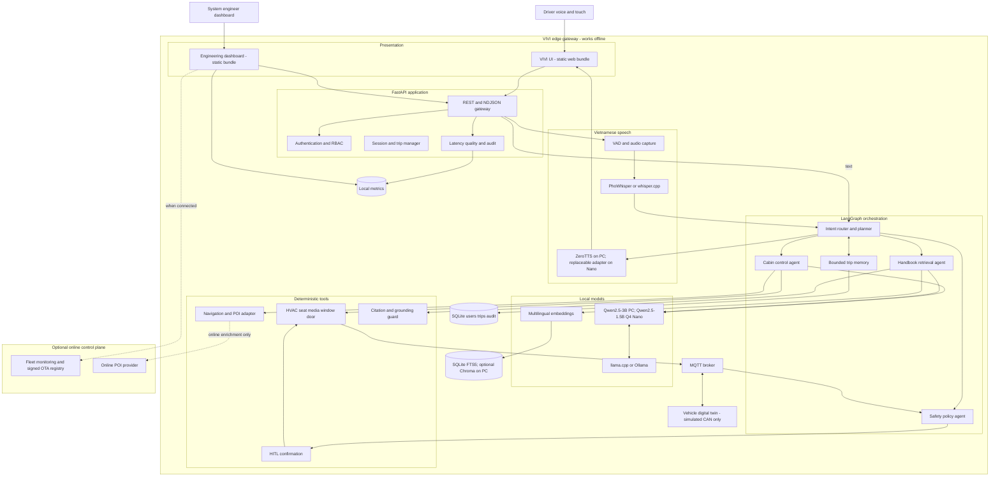
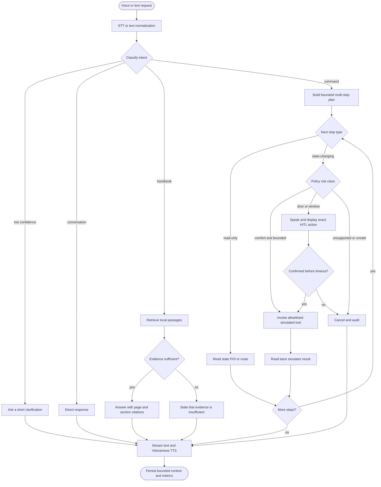
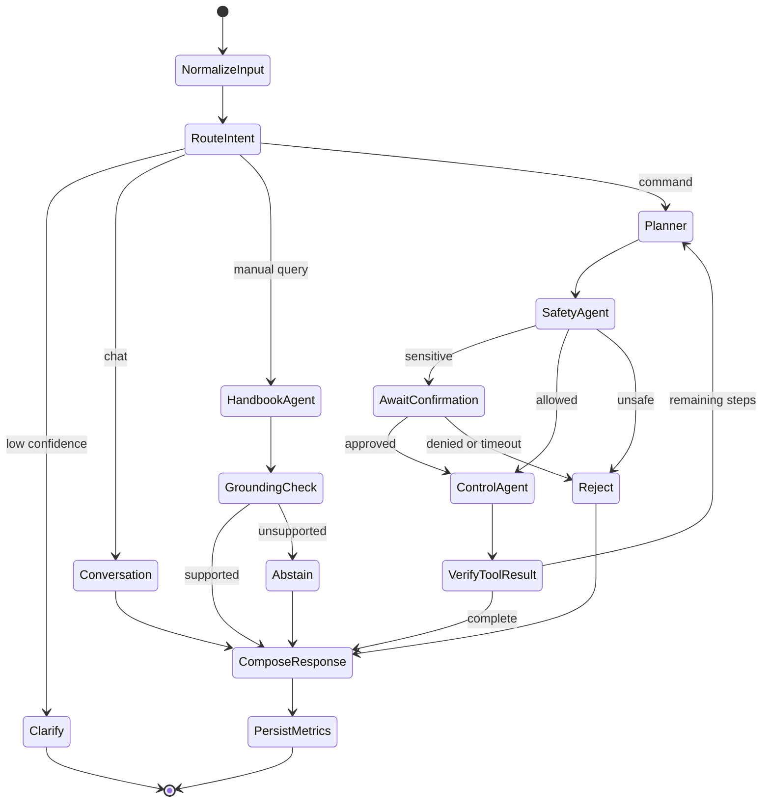
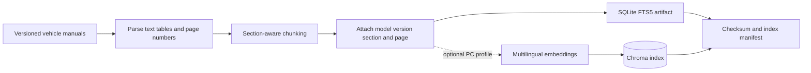
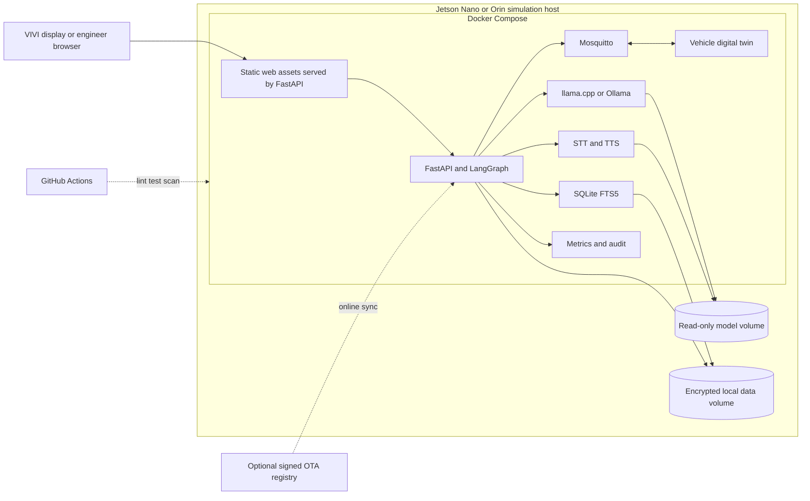

# VIVI Cabin Copilot - Architecture

> **Topic:** DEV-01 - VIVI Cabin Copilot
> **Status:** Target architecture for the five-week build phase
> **Scope:** Edge-first Vietnamese voice and multimodal assistant. Vehicle actions are simulations only.

## 1. Goals and constraints

The system must keep working when the car loses network coverage. Speech, the quantized SLM, trip memory, vehicle tools, handbook index, and observability therefore run on the edge. Online POI and OTA services are optional and never sit on the critical path for cabin controls or handbook Q&A.

1. **Offline first:** the edge runtime owns the full voice-to-response path.
2. **Safety before execution:** deterministic policy and human confirmation sit between agent planning and every sensitive action.
3. **Grounded answers:** handbook responses carry citations or explicitly abstain.
4. **Observable latency:** every stage emits timing data from end-of-speech to first audible response.

## 2. System overview

### Trust boundaries

- The driver UI can request actions but cannot publish directly to MQTT.
- The agent may propose calls; only deterministic policy code can authorize them.
- MQTT and the digital twin are the final boundary. There is no real CAN adapter.
- The optional control plane cannot bypass local safety. OTA artifacts are signed, verified, versioned, and rollback-capable.

## 3. End-to-end interaction flow

### Safety classes

| Class | Examples | Policy |
|---|---|---|
| R0 - Read only | Handbook Q&A, vehicle status, route preview | No confirmation; handbook responses still require citations. |
| R1 - Comfort | Temperature within bounds, media, seat comfort | Validate arguments and live state, execute in simulator, then read back state. |
| R2 - Sensitive physical | Open/close a door or window | Explicit HITL for the exact action, target, and value. Approval expires and is single-use. |
| R3 - Prohibited | Braking, steering, propulsion, disabling safety | Tool is absent or always denied and audited. |

HITL is checked at execution time. A later step cannot reuse an earlier approval. While the simulated vehicle is moving, the UI uses voice-first prompts and blocks nonessential multi-touch flows.

## 4. LangGraph agent design

The graph uses one supervisor with specialized nodes. These nodes satisfy the advanced multi-agent requirement while all final effects remain behind one deterministic safety gateway.

Recommended `AgentState` fields:

| Field | Purpose |
|---|---|
| `session_id`, `trip_id`, `user_role` | Scope identity, authorization, and memory. |
| `input_text`, `input_mode`, `asr_confidence` | Preserve normalized input and voice quality. |
| `intent`, `intent_confidence`, `entities` | Make routing measurable and debuggable. |
| `vehicle_state` | Live snapshot used by policy, never supplied by the LLM. |
| `plan`, `current_step`, `tool_results` | Execute a bounded, auditable multi-step plan. |
| `risk_class`, `confirmation_id`, `confirmation_status` | Bind approval to one exact tool call. |
| `retrieved_chunks`, `citations`, `grounding_score` | Enforce grounded handbook answers. |
| `timings`, `errors` | Measure stage latency and provide graceful recovery. |

The planner is limited by an allowlist, a maximum step count, typed tool schemas, and execution timeouts. Tool results, not model claims, are the source of truth for action success.

## 5. Grounded handbook RAG

At query time the service:

1. Filters by the vehicle model and manual version for the active trip.
2. Retrieves and reranks passages locally, rejecting low relevance.
3. Prompts the SLM to answer only from accepted context.
4. Verifies that every material claim maps to a retrieved chunk.
5. Returns page/section citations, or abstains if evidence is missing or contradictory.

Evaluation includes answerable, unanswerable, ambiguous, and wrong-vehicle-manual questions. A fluent answer without supporting evidence is a failure.

## 6. Component responsibilities

| Component | Technology | Responsibility |
|---|---|---|
| VIVI simulator | Static web bundle; optional Next.js static export | Voice/text input, streaming output, large targets, confirmation modal, offline indicator, citations. |
| Engineering dashboard | Static web bundle | Health, latency, quality, model version, q4/q8 comparison, fleet and OTA status. |
| API gateway | FastAPI, Pydantic, NDJSON | Validation, turn contracts, streaming events, health endpoints. |
| Speech services | PhoWhisper/whisper.cpp; ZeroTTS/replaceable adapter | Offline Vietnamese STT/TTS with confidence and timing events. |
| Agent orchestrator | LangGraph | Intent routing, bounded planning, trip context, recovery, specialist coordination. |
| Local inference | llama.cpp or Ollama | Qwen2.5-3B on PC or Qwen2.5-1.5B Q4 on Nano, plus model metadata. |
| Safety gateway | Deterministic Python policy | Allowlist, state/range/role checks, single-use confirmations, denials. |
| Vehicle adapter | Typed tools plus MQTT | Convert authorized calls to commands and verify acknowledged state. |
| Vehicle digital twin | MQTT publisher/subscriber | Simulate cabin functions, speed, faults, state, and acknowledgements. |
| Handbook service | SQLite FTS5 on edge; optional Chroma on PC | Offline retrieval, citations, grounding threshold, and abstention. |
| Local persistence | SQLite and metrics store | Users, trip memory, audit, evaluation, and latency samples. |
| OTA control plane | Optional mock service | Simulated multi-vehicle monitoring and signed staged rollout/rollback. |

## 7. Interfaces

Các interface đánh dấu **current** thuộc runtime hiện tại. Mục **planned** là backlog kiến
trúc, không được client phụ thuộc cho đến khi có contract test.

| Status | Interface | Purpose |
|---|---|---|
| planned | `POST /api/v1/auth/login` | Authenticate driver or engineer and issue a scoped token. |
| planned | `POST /api/v1/sessions` | Start a trip-scoped assistant session. |
| current | `POST /api/v1/turn` | Canonical text/STT transcript request and final response contract. |
| current | `POST /api/v1/turn/stream` | NDJSON response and safe speech events; WebSocket is deferred until Nano baseline passes. |
| current | `POST /api/v1/confirmations/{id}` | Approve or deny one pending R2 action. |
| current | `GET /api/v1/vehicle/state` | Read current simulated state. |
| current | `PUT /api/v1/demo/vehicle/driving` | Set the per-session driving fixture for the in-memory UI demo only. |
| planned | `GET /api/v1/handbook/sources/{id}` | Resolve a citation to a local passage. |
| planned | `GET /api/v1/metrics/summary` | Engineer-only quality and latency summary. |
| planned | `POST /api/v1/ota/deployments` | Engineer-only simulated OTA rollout. |

| MQTT topic | Direction and payload |
|---|---|
| `vivi/{vehicle_id}/command/{domain}` | Adapter to simulator: typed command, correlation ID, expiry, requester. |
| `vivi/{vehicle_id}/ack/{domain}` | Simulator to adapter: result, state, correlation ID. |
| `vivi/{vehicle_id}/state` | Simulator to system: speed, cabin state, doors, windows, warnings. |
| `vivi/{vehicle_id}/events` | Simulator to observability: faults, disconnects, rejected commands. |

Commands use schema validation, short expiration, idempotency keys, correlation IDs, and acknowledgements. Logs redact raw audio and sensitive text by default.

## 8. Deployment

The same containers run on a development laptop with CPU profiles and smaller models. Jetson-class profiles use the available GPU runtime. Disconnecting WAN must not affect core test cases.

### Classic Jetson Nano 4 GB profile

The API, LangGraph, SQLite FTS5, policy, and MQTT adapter form one lightweight Python
container. `llama.cpp` and `whisper.cpp` are native sidecars because JetPack 4.6.6 cannot
use the PC CUDA 12/PyTorch dependency set. Handbook crawl, parsing, embeddings, and UI
build happen on a PC; the Nano receives immutable artifacts. Models are not all preloaded:
Qwen2.5-1.5B Q4 and whisper.cpp `base` are starting candidates subject to device benchmark.
ZeroTTS remains optional until the measured peak memory leaves adequate headroom.

## 9. Observability and targets

All stages share a `trace_id`. Voice latency starts at detected end-of-speech and ends at the first audible TTS frame. Text latency starts at submission and ends at the first streamed token.

| Signal | Build-phase acceptance target |
|---|---|
| Intent classification | Macro F1 >= 0.90 on the frozen Vietnamese set. |
| Grounded answers | Citation precision >= 0.95; unsupported-answer rate <= 0.05. |
| Sensitive commands | 100% have matching unexpired confirmation; zero real CAN calls. |
| Valid command completion | >= 0.95 successful simulator acknowledgements. |
| Voice command latency | p95 <= 2,500 ms on declared target hardware. |
| Handbook latency | p95 <= 4,000 ms on declared target hardware. |
| Offline capability | 100% of the core suite passes with WAN disabled. |
| Reliability | Invalid, ambiguous, timed-out, and unavailable requests fail gracefully. |

These are prototype targets, not production automotive safety claims. Reports name hardware, model, quantization, input length, sample count, warm/cold state, and percentile method. The q4/q8 comparison includes size, peak memory, tokens/second, latency, intent score, and grounded-answer score.

## 10. Security, privacy, and failure handling

- Driver and system engineer are mandatory roles; metrics and OTA endpoints require engineer authorization.
- LLM output is never raw code or raw MQTT. Every call is parsed into a typed allowlisted schema.
- Confirmation records bind the action hash, user, session, expiry, and decision; replay or modification is rejected.
- Trip memory is bounded to the active trip and can be cleared. Raw audio retention is opt-in and off by default.
- Instructions found in handbook text are treated as data. Ingestion records checksums and source versions.
- STT/SLM/TTS timeout, model crash, MQTT disconnect, and low confidence each have user-facing fallbacks and audit events.
- OTA is a dashboard simulation with manifest verification, staged rollout, health check, and rollback; it never touches a real vehicle.

## 11. Requirements traceability

| Requirement | Architecture element | Evidence |
|---|---|---|
| Driver and engineer roles | FastAPI RBAC and scoped UI | Authorization tests and two demo accounts. |
| Vietnamese voice and text | Offline STT/TTS and WebSocket/text path | Golden commands and latency traces. |
| Vehicle control tools | Typed tools, policy, MQTT twin | Contract tests and simulator acknowledgements. |
| Handbook citations | Versioned index and grounding guard | RAG report with source mappings. |
| HITL for sensitive actions | R2 policy and single-use approvals | Approve, deny, timeout, replay tests. |
| Error handling | Confidence and explicit failure paths | Noisy, ambiguous, offline, fault tests. |
| Offline quantized SLM | Local GGUF q4/q8 runtime | WAN-disabled demo and model manifest. |
| End-to-end latency | Stage spans and metrics dashboard | p50/p95 by hardware and model. |
| Multi-agent | Supervisor, control, handbook, safety nodes | LangGraph traces and routing tests. |
| Intent/hallucination evaluation | Frozen datasets and eval pipeline | Versioned dataset, command, report. |
| Fleet and OTA | Optional simulated control plane | Multi-vehicle dashboard and rollback. |

Task sequencing and acceptance criteria are in the [five-week project plan](project_plan_5_weeks.md).
