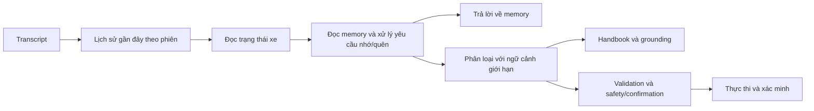

# Bộ nhớ của ViVi

ViVi đã có short-term memory từ lịch sử hội thoại SQLite. Long-term memory mới lưu
thông tin người dùng yêu cầu ghi nhớ vào `<data_dir>/memory/long_term.sqlite3`, mặc
định là `data/memory/long_term.sqlite3`. Toàn bộ xử lý memory chạy local bằng SQLite
và luật, không gọi API, tải model hay chạy embedding.

## Ba nguồn ngữ cảnh

| Nguồn | Nội dung | Vòng đời và cách sử dụng |
| --- | --- | --- |
| Short-term | Câu hỏi/trả lời, intent, kết quả action của phiên | Lấy tối đa `rag_history_turns=6` lượt từ `data/vivi_rag.sqlite3`; prompt model dùng 3 lượt gần nhất đã rút gọn. Khôi phục được khi dùng lại session sau restart. |
| Long-term | Tên, sở thích, yêu cầu/ghi chú, lệnh có tên | Theo hồ sơ người lái, dùng qua nhiều session/restart, tồn tại tới khi sửa hoặc xoá. |
| Trạng thái xe và handbook | Số đo hiện tại, kiến thức kỹ thuật VF8 | Trạng thái đọc từ adapter; kiến thức đọc từ handbook. Memory không thay thế hai nguồn này. |

Short-term là cửa sổ hội thoại gần đây, chưa có tóm tắt tự động hay LangGraph
checkpointer. File lịch sử vẫn có thể chứa các lượt cũ ngoài cửa sổ 6 lượt.
`store_transcripts` điều khiển transcript/EventStore và retention của monitor;
SQLite conversation history hiện vẫn được ghi để phục vụ ngữ cảnh, kể cả khi cờ
này tắt. **Reset history** trên monitor chỉ xoá lịch sử trình duyệt, không xoá
SQLite history hay long-term memory.

## Quy tắc ghi nhớ

Chỉ yêu cầu rõ như “ghi nhớ”, “nhớ rằng”, “từ nay” mới ghi vào long-term memory.
Không tự suy ra sở thích từ một lần chỉnh nhiệt độ, không khai thác log cũ và không
lưu số đo pin/nhiệt độ hiện tại thành sự thật lâu dài. Nếu người dùng chủ động ghi
chú một số đo, đó vẫn là lời người dùng ghi lại, không được dùng thay số đo mới.

Các loại được hỗ trợ:

- `fact`: `display_name` — tên/cách gọi người dùng.
- `preference`: `preferred_temperature` (16–30°C), `preferred_music`,
  `response_style` (ngắn gọn/chi tiết, vẫn trong giới hạn trả lời khi lái xe).
- `note`: nội dung tự do, tối đa 700 ký tự. Ghi chú có tên dùng key ổn định
  `note.<tên-không-dấu>` để sửa, gọi lại và xoá. Ghi chú không có tên dùng hash của
  nội dung để chống lưu trùng; để sửa chính xác, dùng key qua API hoặc đặt tên.
- `command`: transcript của một thao tác đã hỗ trợ, có tên, tối đa 700 ký tự.
  Không lưu mã thực thi, lịch chạy hay quyền xác nhận.

Thông tin cùng key được thay thế atomically, giữ thời điểm tạo, tăng `revision` và
cập nhật thời điểm sửa cùng `source_session_id`/`source_turn_id`. Ghi lại cùng giá
trị không tạo revision mới. Mỗi hồ sơ tối đa 200 mục; không có TTL mặc định.
Mỗi lần mở kết nối dùng transaction ngắn; quota/upsert dùng `BEGIN IMMEDIATE`
để không vượt quota khi nhiều lượt cùng ghi. Không giữ kết nối SQLite lâu dài.

## Các câu có thể thử

| Bạn nói | ViVi xử lý |
| --- | --- |
| “Từ nay gọi tôi là Nam” | Lưu/cập nhật tên; chào hỏi bằng tên ở chế độ rules hoặc đưa tên vào ngữ cảnh model. |
| “Ghi nhớ nhiệt độ tôi thích là 24 độ” | Lưu sở thích; chưa chỉnh điều hoà. |
| “Đặt điều hoà theo sở thích của tôi” | Tạo action 24°C và đi qua validation/safety/verification như bình thường. |
| “Ghi nhớ tôi thích nhạc jazz” / “Phát nhạc tôi thích” | Lưu thể loại; lượt sau tạo `media.play(media_query="jazz")`. Khả năng phát thực tế phụ thuộc vehicle/media adapter. |
| “Nhớ rằng tôi hay đi cùng trẻ nhỏ” | Lưu một ghi chú; không tự sửa chính sách hoặc kích hoạt thao tác. |
| “Ghi nhớ ghi chú địa chỉ nhà: nhà tôi ở Huế” | Lưu/cập nhật `note.dia-chi-nha`. |
| “Bạn nhớ gì về địa chỉ nhà?” | Đọc ghi chú liên quan; không tra handbook. |
| “Ghi nhớ lệnh thư giãn: mở cửa sổ bên tài 50%” | Kiểm tra cú pháp và lưu transcript của lệnh; chưa mở cửa sổ. |
| “Thực hiện lệnh thư giãn” | Phân tích lại lệnh với trạng thái xe mới; vẫn phải xác nhận/chịu policy hiện tại. |
| “Tên tôi là gì?” / “Tôi thích nhạc gì?” | Đọc thông tin hiện đang lưu, không đoán lại từ log đã xoá memory. |
| “Bạn nhớ gì về tôi?” | Đọc tối đa 5 mục; API trả danh sách đầy đủ. |
| “Quên nhiệt độ tôi thích” / “Quên lệnh thư giãn” / “Quên ghi chú địa chỉ nhà” | Xoá đúng mục được chỉ định. Yêu cầu không rõ thì hỏi lại. |
| “Xoá toàn bộ bộ nhớ của tôi” | Xoá tất cả long-term memory của hồ sơ hiện tại. |

Parser hiện dùng các mẫu tiếng Việt trên, có hỗ trợ không dấu. Không có model tự
trích xuất thông tin từ mọi kiểu diễn đạt. Ghi chú tự do được tìm bằng từ khoá;
chưa có semantic search, suy luận sở thích ngầm hay tự chạy yêu cầu có điều kiện.
Ví dụ “nếu trời lạnh tôi thích 28 độ” được giữ như ghi chú, không thành nhiệt độ
mặc định áp dụng trong mọi hoàn cảnh.

## Luồng xử lý và mức độ tin cậy



Những yêu cầu về memory được xử lý deterministic trước model. Gọi lại một lệnh
có tên dùng rules để tạo action rồi vào cùng safety graph với lệnh trực tiếp.
Lệnh tương đối như “tăng điều hoà 2 độ” dùng nhiệt độ mới đọc khi gọi lại, không
dùng nhiệt độ ở lúc ghi nhớ. Qua hội thoại, thiếu thông tin, nhiều thao tác, phủ định, điều kiện,
tool không hỗ trợ hoặc sai phạm vi tham số sẽ không được lưu thành lệnh hợp lệ.

Ngữ cảnh model gồm tối đa 8 mục và 2.000 ký tự JSON (cấu hình được). Sở thích có
kiểu được ưu tiên, ghi chú/lệnh khác cần có từ khoá liên quan. Nội dung nằm trong
user message, được đánh dấu là dữ liệu tham khảo; không nối vào system prompt.
Prompt yêu cầu model không xem memory là quyền thực thi hay chỉ dẫn vượt policy.
RAG generator tiếp tục dựa vào handbook; memory không được trộn vào evidence hay
citation kỹ thuật. Ở chế độ rules, ghi chú tự do có thể nhớ/xem/quên nhưng chưa tự
ảnh hưởng mọi câu trả lời; chế độ model nhận ngữ cảnh có liên quan để cá nhân hoá.

Nếu đọc memory lỗi, lệnh xe và RAG thông thường vẫn tiếp tục; yêu cầu nhớ/quên hoặc
dùng lệnh đã nhớ không được báo thành công khi dữ liệu chưa xử lý được. Lỗi có
stage/timing trong output để kiểm tra.

## Hồ sơ và cấu hình

```toml
memory_enabled = true
memory_profile_id = "default"
memory_context_limit = 8
memory_context_max_characters = 2000
# Tuỳ chọn: memory_db = "./data/memory/long_term.sqlite3"
```

Biến môi trường: `VIVI_MEMORY_ENABLED`, `VIVI_MEMORY_PROFILE_ID`, `VIVI_MEMORY_DB`.
Đường dẫn mặc định đi theo `data_dir`. Đổi cấu hình thì restart backend.

Bản hiện tại giả định một người lái với hồ sơ `default`, không nhận diện người nói
hay tự đổi hồ sơ theo session. Session mới của cùng hồ sơ vẫn dùng cùng long-term
memory. Có thể cấu hình hồ sơ khác để dùng vùng dữ liệu riêng; history của hồ sơ
khác được namespace riêng, giữ nguyên history cũ của `default`. Đây là lựa chọn
hồ sơ phía server, chưa phải hệ thống đăng nhập hay phân quyền nhiều người dùng.

## API và reset

API quản lý **hồ sơ đang cấu hình**, không lấy profile từ request client:

- `GET /api/v1/memory`: danh sách đầy đủ và provenance.
- `PUT /api/v1/memory/{key}`: thêm/cập nhật, body `{kind, value, label?}`.
- `DELETE /api/v1/memory/{key}`: xoá một mục.
- `DELETE /api/v1/memory`: reset long-term memory của hồ sơ hiện tại.

API kiểm tra schema và phạm vi của các sở thích có kiểu. Transcript command được
lưu như văn bản; khi gọi lại luôn được phân loại và kiểm tra lại, nên ghi trực tiếp
qua API cũng không cấp quyền thực thi hay bỏ qua policy.

```bash
curl http://127.0.0.1:8787/api/v1/memory
curl -X PUT http://127.0.0.1:8787/api/v1/memory/preferred_temperature \
  -H 'Content-Type: application/json' \
  -d '{"kind":"preference","value":24}'
curl -X DELETE http://127.0.0.1:8787/api/v1/memory
```

API reset có hiệu lực ngay. Muốn reset tất cả hồ sơ bằng file, dừng backend rồi xoá
thư mục `data/memory/` và khởi động lại; database sẽ được tạo mới. Nếu đã đổi
`memory_db`, xoá database ở đường dẫn đó thay vì thư mục mặc định.
Handbook, vector index, audio và lịch sử hội thoại ở các đường dẫn khác vẫn giữ
nguyên. Không tự khôi phục các mục đã quên từ history. Reset long-term memory
không xoá transcript/log cũ; để xoá mọi nội dung hội thoại cần xử lý các kho lịch
sử riêng. `data/memory/` được bỏ qua bởi Git.

## Kiểm tra

```bash
.venv/bin/pytest -q tests/test_long_term_memory.py
.venv/bin/python -m eval.memory_benchmark
```

`eval/memory_cases.jsonl` gồm 29 lượt theo các chuỗi nhớ/sửa/đổi phiên/restart/quên/
reset/lệnh có tên và safety. Nhãn là bản draft để người dùng chỉnh. Runner dùng
database tạm, cấm TCP, dùng xe mô phỏng và không đọc/ghi bộ nhớ thật của người
dùng. Báo cáo ở `eval/results/memory-dev.json` gồm kết quả từng lượt và p50/p95
latency toàn graph. Đây là regression deterministic trên máy phát triển, chưa
đo chất lượng SLM/STT hoặc latency khi cùng chạy STT/TTS/SLM trên AGX Xavier.
