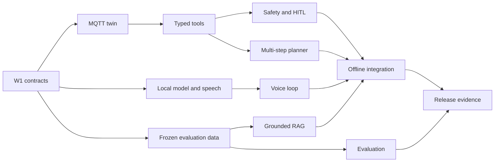

# VIVI Cabin Copilot - Five-Week Project Plan

> **Planned window:** 21 September 2026 - 25 October 2026
> **Delivery model:** Five weekly increments, each ending with an integrated demo
> **Architecture:** [VIVI Cabin Copilot architecture](architecture_diagram.md)

If kickoff changes, move the dates while preserving sequence, dependencies, and exit gates.

## 1. Objective and scope

At the end of five weeks, the team will deliver a Dockerized VIVI simulator that accepts Vietnamese voice/text, answers handbook questions with citations, and executes allowlisted commands through an MQTT vehicle twin. It supports driver and engineer roles, requires HITL for sensitive physical actions, works without WAN using a quantized local SLM, and publishes quality and latency evidence.

| Priority | Commitment |
|---|---|
| P0 - Must ship | Two roles; Vietnamese text/voice; single and multi-step commands; MQTT simulator; grounded RAG; HITL for doors/windows; graceful errors; offline q4; intent, grounding, latency metrics; Docker and tests. |
| P1 - Should ship | q4/q8 comparison, specialist agents, trip memory, engineering dashboard, simulated fleet monitoring and signed OTA rollback. |
| P2 - Stretch | Better reranker, local map/POI pack, extra vehicle domains, GPU tuning, richer fleet analytics. |

P0 is protected. P2 starts only after the current P0 exit gate passes.

## 2. Timeline

| Week | Dates | Theme | Exit milestone |
|---|---|---|---|
| 1 | 21-27 Sep | Foundations and risk spikes | Text command controls the MQTT twin end to end; architecture, schemas, datasets, benchmark harness are versioned. |
| 2 | 28 Sep-4 Oct | Voice-first control MVP | Driver issues Vietnamese voice/text commands and receives verified state; engineer sees stage timing. |
| 3 | 5-11 Oct | Grounding, safety, planning | RAG cites or abstains; doors/windows require exact HITL; a three-step trip request completes. |
| 4 | 12-18 Oct | Offline, evaluation, operations | Core suite passes without WAN; q4/q8 and quality reports are visible; OTA happy path and rollback work. |
| 5 | 19-25 Oct | Hardening and Demo Day | Release candidate passes P0; reproducible setup, report, architecture, deck, and video are ready. |

## 3. Weekly task plan

### Week 1 - Foundations and risk retirement

- [ ] `W1-01` Confirm user journeys, Vietnamese intents, argument ranges, R0-R3 safety classes, and non-goals.
- [ ] `W1-02` Freeze API/OpenAPI shapes, MQTT schemas, LangGraph state, error taxonomy, and timing schema.
- [ ] `W1-03` Scaffold Next.js views, FastAPI modules, LangGraph, local persistence, and Docker profiles.
- [ ] `W1-04` Build MQTT twin for HVAC, media, seats, windows, doors, speed, warnings, acknowledgements, and fault injection.
- [ ] `W1-05` Deliver a typed text-command vertical slice through MQTT acknowledgement and UI state refresh.
- [ ] `W1-06` Spike one STT, TTS, and q4/q8 SLM candidate; record size, memory, throughput, and warm latency.
- [ ] `W1-07` Version a legally usable handbook sample with model/version/page metadata.
- [ ] `W1-08` Freeze evaluation set v0: intents, entities, answerable/unanswerable RAG, and sensitive commands.
- [ ] `W1-09` Add CI for lint, tests, secret checks, Docker build, review ownership, worklog cadence.

**Exit gate:** from a clean checkout, a command such as `dat dieu hoa 24 do` updates the MQTT simulator and returns acknowledged state. Invalid schemas do not crash the API.

### Week 2 - Voice-first control MVP

- [ ] `W2-01` Add driver and engineer login/RBAC with forbidden-endpoint tests.
- [ ] `W2-02` Add audio capture, VAD, Vietnamese STT, normalization, and text fallback.
- [ ] `W2-03` Integrate local GGUF q4 and expose model, quantization, size, and health.
- [ ] `W2-04` Add intent routing and typed tools for HVAC, seat, media, navigation preview, window, and door simulation.
- [ ] `W2-05` Add TTS streaming, cancel behavior, concise responses, offline indicator, and large touch targets.
- [ ] `W2-06` Verify MQTT acknowledgement before success; add timeout, idempotency, and disconnect fallbacks.
- [ ] `W2-07` Instrument VAD, STT, router, model, tool, TTS spans; show p50/p95 and errors.
- [ ] `W2-08` Test supported commands, invalid values, low confidence, MQTT timeout, and role checks.

**Exit gate:** at least five Vietnamese voice/text intents work. Every action reflects simulator state and every request has a complete latency trace.

### Week 3 - Grounded RAG, HITL, and multi-step planning

- [ ] `W3-01` Build repeatable handbook parsing, section-aware chunks, metadata, embeddings, and checksum manifest.
- [ ] `W3-02` Add local retrieval/reranking with vehicle-version filters and relevance threshold.
- [ ] `W3-03` Generate evidence-only answers with page/section citations, claim verification, and abstention.
- [ ] `W3-04` Add deterministic policy, argument bounds, prohibited actions, and moving-vehicle UI restrictions.
- [ ] `W3-05` Add single-use HITL for doors/windows: exact preview, expiry, denial, modification and replay protection.
- [ ] `W3-06` Add bounded multi-step plans, per-step policy, result verification, recovery, and step limit.
- [ ] `W3-07` Add trip-scoped memory and reset; never infer physical state from memory.
- [ ] `W3-08` Separate supervisor, control, handbook, and safety nodes and record routing traces.
- [ ] `W3-09` Test citations, abstention, handbook injection, HITL outcomes, and partial-plan failure.

**Exit gate:** the cafe + 24-degree HVAC + navigation example completes as a bounded plan. A door/window step cannot execute without fresh approval. Handbook Q&A cites valid local passages or abstains.

### Week 4 - Offline validation, evaluation, and operations

- [ ] `W4-01` Run the complete core regression suite with WAN blocked and remove cloud dependencies.
- [ ] `W4-02` Benchmark q4/q8 on identical hardware, prompts, samples, and warm/cold conditions.
- [ ] `W4-03` Publish per-class intent precision/recall/F1, confusion matrix, entity accuracy, and low-confidence rate.
- [ ] `W4-04` Publish RAG citation precision, answer support, abstention, and unsupported-answer rate.
- [ ] `W4-05` Complete engineer dashboard for health, model, latency, quality, audit, and vehicle state.
- [ ] `W4-06` Simulate vehicle heartbeats and staged OTA with manifest verification, canary failure, and rollback.
- [ ] `W4-07` Test voice-first usability, confirmation clarity, cabin noise, and reduced interaction while moving.
- [ ] `W4-08` Tune memory/CPU/GPU, context, threads, caching, concurrency, and startup without weakening gates.

**Exit gate:** core tests pass offline; evaluation is reproducible with one command; dashboards use collected data, not constants; simulated OTA rollback is demonstrable.

### Week 5 - Hardening, release, and presentation

- [ ] `W5-01` Freeze features and triage defects by safety, data loss, demo blocker, and polish.
- [ ] `W5-02` Inject model/STT/TTS crash, MQTT disconnect, corrupt index, delay, invalid token, confirmation timeout.
- [ ] `W5-03` Review RBAC, validation, secrets, log redaction, session cleanup, dependencies, images, and audit.
- [ ] `W5-04` Test clean-machine and edge install, health checks, volumes, seed data, offline startup, and rollback.
- [ ] `W5-05` Finish README, setup/troubleshooting, API, architecture, manifests, journal, worklog, and licenses.
- [ ] `W5-06` Publish `eval/results/report.md` with environment, data/model versions, commands, results, limitations.
- [ ] `W5-07` Prepare deck and <=5-minute video showing offline, citations, HITL, planning, latency, q4/q8.
- [ ] `W5-08` Rehearse live and recorded fallback with reset script, preloaded models, and named operators.
- [ ] `W5-09` Tag release candidate only when P0 acceptance passes and critical defects are closed.

**Exit gate:** a reviewer can clone and run documented commands; the candidate passes P0 and all ten template deliverables are present or linked.

## 4. Workstreams and ownership

Assign one directly responsible individual and one reviewer to each task. On a small team, one person may own several streams.

| Workstream | Responsibility | Key handoff |
|---|---|---|
| Product and UX | Journeys, voice-first UI, driver safety, demo, user tests | Intent catalog and confirmation copy to Agent/Safety. |
| Edge ML and speech | SLM/STT/TTS, quantization, performance | Stable local endpoints and model manifest. |
| Agent, RAG, safety | LangGraph, tools, memory, retrieval, grounding, HITL | Typed calls, citations, and policy events. |
| Platform and simulator | FastAPI, auth, MQTT twin, persistence, Docker, OTA mock | API/MQTT contracts and deployable images. |
| QA and observability | Data, tests, metrics, CI, acceptance report | Daily regressions and release evidence. |

## 5. Dependencies and critical path

The critical path is contracts -> local runtime/twin -> voice and tools -> safety/RAG/planner -> offline integration -> evidence. Fleet/OTA and visual polish must not delay it.

## 6. Acceptance checklist

### Functional and safety

- [ ] Driver and engineer login works; restricted endpoints reject the wrong role.
- [ ] Voice and text cover the declared Vietnamese catalog and clarify low confidence.
- [ ] Tools affect only MQTT simulation and verify state before reporting success.
- [ ] Every R2 execution has a matching unexpired single-use confirmation; deny/timeout executes nothing.
- [ ] R3 actions are absent or deterministically rejected.
- [ ] Multi-step plans have typed steps, a hard limit, per-step policy, and understandable partial failure.
- [ ] Handbook answers have valid version/page/section citations; insufficient evidence causes abstention.
- [ ] Trip memory can be reset and never substitutes for live vehicle state.

### Performance, evaluation, and operations

- [ ] Core regression passes with WAN disabled.
- [ ] Voice p95 <=2,500 ms and handbook p95 <=4,000 ms on declared hardware, or variance has a remediation plan.
- [ ] Intent macro F1 >=0.90 on the frozen set.
- [ ] Citation precision >=0.95 and unsupported-answer rate <=0.05.
- [ ] q4/q8 report includes size, peak memory, throughput, p50/p95, intent score, and grounded-answer score.
- [ ] Dashboard uses real traces/audit and filters by vehicle, model, and time.
- [ ] Simulated OTA verifies a manifest and demonstrates failed-canary rollback.
- [ ] A non-author tests clean install, health checks, offline startup, and recovery instructions.

## 7. Definition of Done

A task is done only when:

1. Code/config and automated tests are merged after review.
2. Acceptance passes locally; edge-specific work also passes on declared target hardware.
3. Relevant safety, privacy, latency, and audit behavior is instrumented.
4. User-facing failure behavior exists; no silent fallback hides a failure.
5. API/schema/architecture/runbook documentation changes in the same merge.
6. Evaluation identifies data, model, quantization, hardware, commit, and command for reproduction.

## 8. Risks and contingency

| Risk | Early signal | Mitigation | Contingency |
|---|---|---|---|
| Edge latency | Week 1 spike misses by >30% | Smaller context, streaming, q4, thread/GPU tuning | q8 becomes benchmark-only; template concise control responses. |
| Noisy Vietnamese STT | Entity errors rise on noisy set | Domain vocabulary and noise samples | Text fallback and focused clarification. |
| Malformed tool calls | Schema retry rate rises | Constrained typed output and examples | Deterministic parser for core controls. |
| RAG hallucination | Unsupported answer >5% | Filters, reranker, threshold, claim verifier | Narrow scope and abstain more. |
| HITL replay/bypass | Negative safety test executes | Action hash, expiry, session binding, single use | Disable affected R2 tool until fixed. |
| Artifact/hardware delay | Missing by end of Week 1 | Pin and checksum candidates early | Develop on CPU and declare fallback hardware. |
| Scope pressure | P0 gate slips >2 days | Stop P2 and swarm critical path | Keep multi-agent/OTA minimal and honest. |
| Demo failure | Rehearsal instability | Offline assets, warmup, spare device | Recorded fallback with metric evidence. |

## 9. Cadence and evidence

- **Daily:** 15-minute blocker/risk sync; update owner/status and `WORKLOG.md`; review failed CI/evaluation.
- **Midweek:** integrated test on the shared edge profile and check the weekly exit gate.
- **Weekly:** increment demo, metric snapshot, risk review, `JOURNAL.md`, and next-week commitment.
- **Release:** safety regression, ungrounded claims, or loss of offline core blocks release regardless of polish.

Store raw results under `eval/`, summarize them in `eval/results/report.md`, and keep changes synchronized with the [architecture document](architecture_diagram.md).
